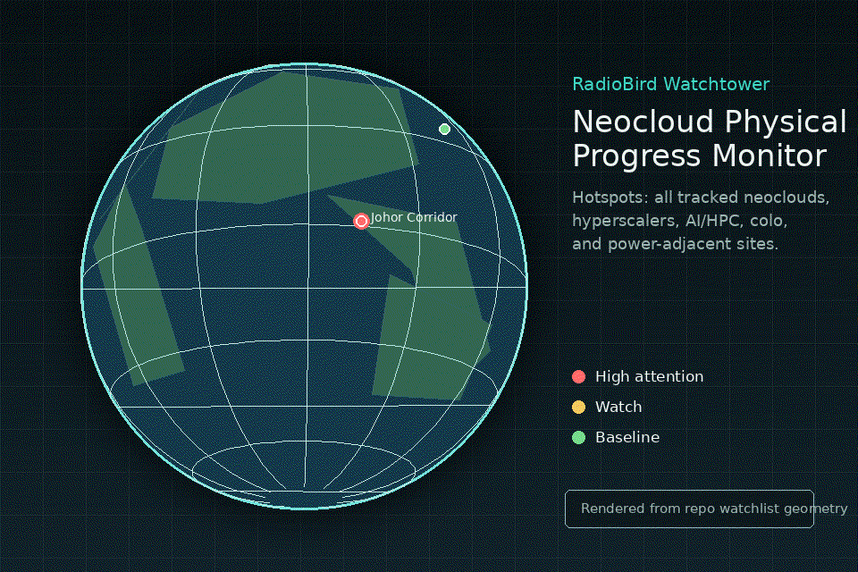

# RadioBird Supply Chain Watchtower

Public-data supply-chain anomaly monitor built from the RadioBird direction.

The system watches supply-chain regions/assets using legal public data only,
scores deviations from local baselines, and emits market-facing notes.

## MVP Scope

- Config-driven watchlist of regions/assets and linked tickers.
- SQLite event/baseline/anomaly store.
- Public-data ingestor interface.
- Fixture ingestor for AIS/ADS-B style activity until provider keys are added.
- Weather ingestor using wttr.in JSON for live environmental disruption context.
- NOAA/NWS public weather adapter for US assets with coordinates.
- OpenSky public ADS-B adapter for anonymous bbox aircraft counts.
- Simple baseline anomaly scoring.
- CLI reports suitable for group discussion.

## Quick Start

```bash
python -m venv .venv
. .venv/bin/activate
pip install -e .
watchtower init-db
watchtower ingest --config config/watchlist.example.json
watchtower score --config config/watchlist.example.json
watchtower report --config config/watchlist.example.json
```

Or run the full pipeline:

```bash
watchtower run --config config/watchlist.example.json
```

Run with public provider adapters:

```bash
watchtower run --config config/watchlist.example.json --weather-provider noaa --adsb-provider opensky
```

The NOAA adapter only emits observations for US assets with coordinates. The OpenSky adapter counts visible aircraft in each asset bbox as a coarse MVP proxy.

## Local Globe UI

A self-contained rotating globe prototype lives in `web/`. It uses local HTML,
CSS, and JavaScript only; there are no network-dependent runtime assets.



Rendered video asset: [`assets/radiobird-globe-demo.mp4`](assets/radiobird-globe-demo.mp4)

Serve it from the project root:

```bash
python3 -m http.server 8877 --bind 127.0.0.1 --directory web
```

Then open:

```text
http://127.0.0.1:8877/
```

The globe includes representative neocloud/data-center hotspots such as IREN
Sweetwater, Northern Virginia, Memphis, Dublin, Lulea, Johor, Tokyo, and
Lancaster. Click markers or hotspot rows to inspect each site's operator,
construction stage, and public-signal watch note.

Regenerate the README media:

```bash
python3 scripts/render_globe_media.py
```

## Cadence Runner

Run only assets due for their configured cadence:

```bash
watchtower cadence --config config/watchlist.example.json --state data/cadence_state.json
```

Force an immediate hourly-style sweep:

```bash
watchtower cadence --config config/watchlist.example.json --force
```

Cron example:

```cron
0 * * * * cd /path/to/project_radiobird_watchtower && . .venv/bin/activate && watchtower cadence --config config/watchlist.example.json >> data/watchtower.log 2>&1
```

## GitHub Issue Checkpoints

The hourly checkpoint runner executes the cadence sweep and posts a concise update to issue #6.
Every GitHub comment is passed through the local privacy guard with `--surface github`.

Manual forced run:

```bash
PYTHONPATH=src python scripts/hourly_issue_update.py --force
```

Install the user timer:

```bash
mkdir -p ~/.config/systemd/user
cp systemd/radiobird-watchtower.service ~/.config/systemd/user/
cp systemd/radiobird-watchtower.timer ~/.config/systemd/user/
systemctl --user daemon-reload
systemctl --user enable --now radiobird-watchtower.timer
```

## Project Notes

- South China Sea / Taiwan semis lane: clips like civilian aircraft receiving Chinese navy warnings near artificial islands are examples of qualitative "physical-world pressure signals." They are not trades by themselves, but they should raise monitoring intensity for contested air/sea zones, unusual ADS-B/AIS behavior, port congestion, insurers, defense names, and market-linked semiconductor supply lanes such as TSMC, Hsinchu/Taiwan export routes, NVDA, AMD, and MU.
- Neocloud/data-center watchtower: monitor every major neocloud and AI-infrastructure campus with timestamped public imagery metadata, public satellite/aerial imagery where licensed, utility/substation context, permits, press releases, and earnings-call claims. The useful question is not "is the company talking about capacity?" but "what is physically built, energized, and plausibly rack-ready?"
- Initial site template: IREN Sweetwater, TX near 32.47, -100.41; reported as a 2.0 GW planned campus with AEP Texas / ERCOT grid exposure and under-construction status. Track shell completion, roads/pads, substations/switchyards, transformer yards, cooling/mechanical rooftop equipment, material staging, parking/activity, expansion pads, and visible deltas between passes.
- Current imagery resolution note for IREN Sweetwater as of 2026-08-30: fresh Sentinel-2 L2A coverage exists for 2026-08-29T17:34:58Z, tile `S2B_14SLA_20260829_0_L2A`, about 2.6% cloud cover, true-color / RGB bands at 10 m GSD. That is good enough for large pads, roads, broad grading, and major shell footprints, but not enough for rack installs, small transformers, detailed rooftop equipment, or vehicle counts. Public NAIP/USGS orthoimagery can reach roughly 0.3-1.0 m GSD in the US, but it is archive/biennial-ish rather than fresh. For decisive monthly/weekly construction state, RadioBird needs a commercial source such as Maxar/Planet/BlackSky/Airbus or licensed aerial imagery with sub-meter tasking/catalog access.
- Bayesian evidence mapping: sub-meter imagery showing completed shells plus installed switchyards/transformers/mechanical equipment should raise confidence in near-term energization; 10 m imagery showing only grading/pads should count as weak evidence; press releases without matching physical progress should be flagged as capex/ARR credibility risk.

### Task: Neocloud / Data-Center Progress Deviation Detector

First goal: detect deviations in visible project progress across all tracked neoclouds and data-center campuses. IREN Sweetwater is only the seed validation site, not the scope boundary.

- Maintain a target universe of public and private neocloud operators, hyperscaler campuses, AI/HPC data centers, colocation campuses, and power-adjacent expansion sites where public signals can be legally monitored.
- Build a per-site expected-progress ledger: public company guidance, permits, utility interconnect milestones, substation/transformer evidence, announced MW/GW phases, earnings-call claims, and expected construction stages by date.
- Ingest dated imagery observations with source, timestamp, GSD/resolution, cloud percentage, off-nadir angle if available, bounding box, and whether the image is a full tile, rough thumbnail, site crop, or sub-meter scene.
- Extract coarse visual states first: no visible work, grading/clearing, roads/pads, shell foundations, building shells, switchyard/substation work, transformer/cooling/mechanical evidence, parking/material staging, and expansion pads.
- Compare observed state to expected state and emit a deviation score: ahead of schedule, on track, delayed, stalled, over-claimed, or insufficient evidence.
- Accommodate errors explicitly. Lower confidence or suppress alerts when imagery is stale, cloudy, smoky/hazy, snow-covered, seasonally confusing, low-resolution, poorly georeferenced, only a tile thumbnail, taken at a bad sun angle, or when visual change could be agriculture/roadwork/non-campus construction nearby.
- Require confirmation across either two imagery passes or one imagery pass plus a non-imagery signal before labeling a market-facing deviation.
- Store both the best estimate and uncertainty: `observed_state`, `expected_state`, `deviation_label`, `confidence`, `error_flags`, `evidence_urls`, and `next_check`.
- Initial alert policy: only page humans for high-confidence schedule slippage, physical progress materially ahead of guidance, or company claims that conflict with visible site state. Everything else should become a watchlist note.

## Legal Boundary

This project is for public/legal data sources only: public weather, AIS/ADS-B
providers, satellite pass metadata, public imagery metadata, and owned/authorized
RF captures. It must not decode secret communications or bypass access controls.
